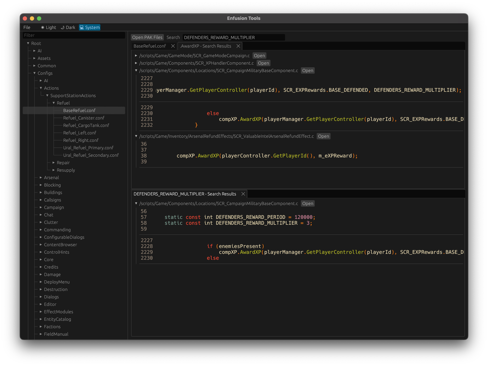

# enfusion_tools

Some tools for interacting with the enfusion engine.

## Tools

### `crates/enfusion_pak`

A command line tool + library for dumping information from `pak` files. The data format was reverse engineered by me. Some pre-existing parsers were used to validate whether or not my own parsing logic was correct. For example, [`PakExplorer`](https://github.com/FlipperPlz/PakExplorer/blob/d559a4f38eeb348754cbe7a13758708c10e73937/Pak/Pak.cs) was referenced to see if my own understanding of the format matched what others had reverse engineered.

I believe that my description of the format _may_ be the most accurate description at this time.

See [`crates/enfusion_pak/README.md`](crates/enfusion_pak/README.md) for more info.

### `crates/ui`

A UI for interacting with Reforger PAK files. Supports search, file filtering, and tabs with docking. The UI can run either in web as a WASM single-page application or as a native desktop application on Windows, Linux, or macOS.

Prebuilt binaries can be found on the [Releases](https://github.com/landaire/enfusion_tools/releases) page.



Demo of the application running in web:

[](https://www.youtube.com/watch?v=Ps1BfcD3Hcs)

## Building

After cloning the repo, you can run the native UI with the following command from the repo root:

```
cargo run --release --bin ui
```

Or to run the web UI, first [install Trunk](https://trunkrs.dev/):

```
cd crates/ui
trunk serve
```